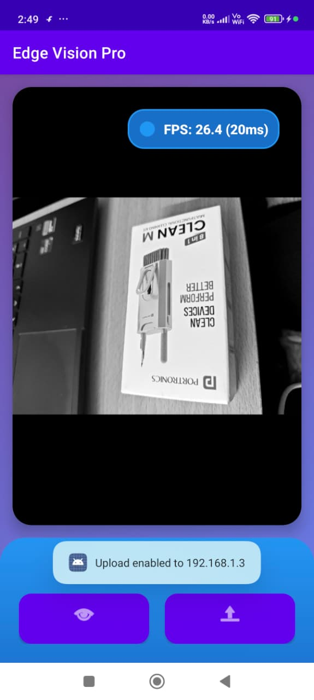
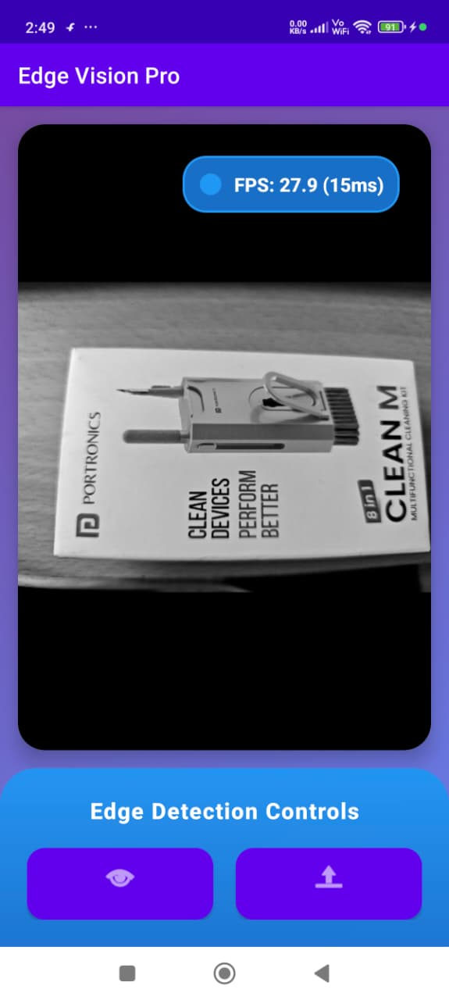
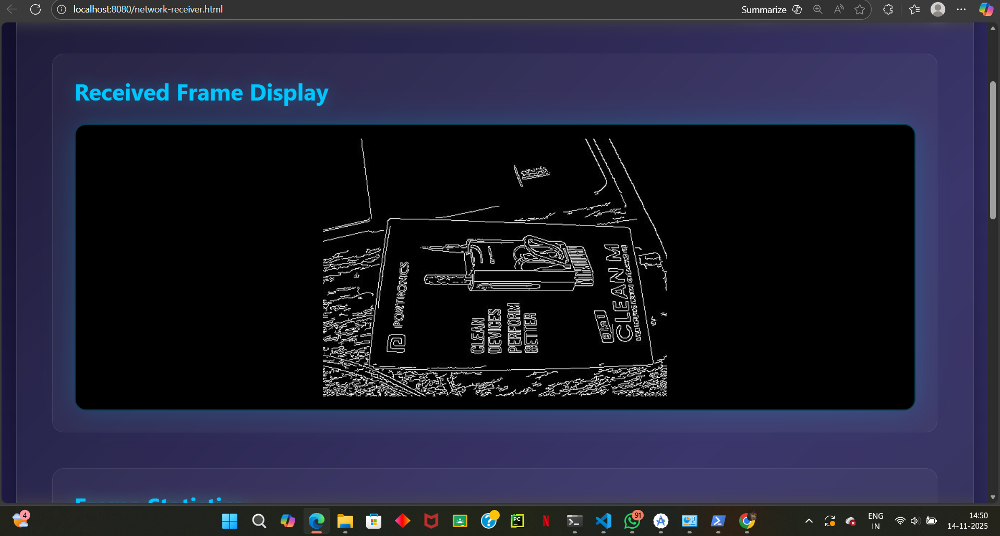

#  Edge Vision Pro - Real-Time Computer Vision System

   

**A cutting-edge mobile computer vision application with real-time edge detection and live streaming capabilities**

---

##  Screenshots

### Android Application

  
  
  

### Web Viewer Dashboard

  
  

---

##  Features

### Android App
-  Camera2 API with real-time capture (25-30 FPS)
-  OpenCV C++ native processing via JNI/NDK
-  Canny edge detection with configurable thresholds
-  Portrait 9:16 optimization for mobile viewing
-  Background HandlerThread processing
-  Smart frame skipping with AtomicBoolean gates
-  Toggle between edge detection and raw feed
-  Real-time FPS monitoring
-  Network streaming via HTTP/WebSocket (~1 FPS)
-  Modern Material Design UI with gradients

### Web Viewer
-  Real-time WebSocket frame receiver
-  Canvas-based hardware-accelerated rendering
-  Dark cyberpunk-themed UI design
-  Statistics dashboard (FPS, resolution, frame count)
-  Connection status monitoring
-  Built-in webcam demo for testing

---

##  Quick Start

### Prerequisites
- Android Studio (Hedgehog+)
- Android NDK 25.x+
- CMake 3.22.1+
- Node.js 18.x+
- OpenCV Android SDK 4.x

### Installation

1. Clone repository:
\\\ash
git clone https://github.com/yourusername/EdgeVisionPro.git
cd EdgeVisionPro
\\\

2. Setup OpenCV SDK:
\\\ash
# Download from opencv.org and extract
mkdir -p app/src/main/cpp/opencv
cp -r ~/Downloads/OpenCV-android-sdk/sdk app/src/main/cpp/opencv/
\\\

3. Open in Android Studio and sync Gradle

4. Build and run:
\\\ash
./gradlew assembleDebug
adb install app/build/outputs/apk/debug/app-debug.apk
\\\

5. Setup web viewer:
\\\ash
cd web
npm install
npm run dev
\\\

6. For network streaming, update MainActivity.kt with your PC IP:
\\\kotlin
val serverIp = \"192.168.1.3\"  // Your PC IP
\\\

See [NETWORK_UPLOAD_GUIDE.md](NETWORK_UPLOAD_GUIDE.md) for network setup details.

---

##  Configuration

### Edge Detection Sensitivity
Edit \pp/src/main/cpp/edge_processor.cpp\:
\\\cpp
cv::Canny(gray, edges, 50, 150);  // Current
// Try: 30, 100 (more edges) or 100, 200 (fewer edges)
\\\

### Camera Resolution
Edit \CameraManager.kt\:
\\\kotlin
private const val MAX_PREVIEW_WIDTH = 1080
private const val MAX_PREVIEW_HEIGHT = 1920
\\\

### Upload Rate
Edit \MainActivity.kt\:
\\\kotlin
private val UPLOAD_EVERY_N_FRAMES = 30  // ~1 FPS
\\\

---

##  Performance

| Metric | Value |
|--------|-------|
| Local Processing FPS | 25-30 |
| Processing Latency | 16-30ms |
| Network Upload FPS | ~1 |
| Network Latency | 100-200ms |
| Memory Usage | ~120MB |

---

##  Troubleshooting

### Black Screen
- Check camera permissions
- Verify Camera2 API support (Android 5.0+)
- Check Logcat for errors

### Low FPS
- Reduce camera resolution
- Increase Canny thresholds
- Disable network upload
- Check device thermal throttling

### Network Upload Fails
- Verify same WiFi network
- Check server running (\
pm run dev\)
- Confirm PC IP in MainActivity.kt
- Add firewall rules (see NETWORK_UPLOAD_GUIDE.md)

### Web Viewer Disconnected
- Ensure server running
- Click \"Start WebSocket\" button
- Check browser console for errors
- Verify port 8081 not blocked

---

##  Resources

- [Android Camera2 API](https://developer.android.com/training/camera2)
- [OpenCV Documentation](https://docs.opencv.org/)
- [JNI Specification](https://docs.oracle.com/javase/8/docs/technotes/guides/jni/)
- [WebSocket API](https://developer.mozilla.org/en-US/docs/Web/API/WebSockets_API)

---

##  License

MIT License - see LICENSE file for details.

---

##  Author

**Viraj**  
GitHub: [@Virajcreates](https://github.com/Virajcreates)

---

** Star this repo if you found it helpful! **

Made with  using Kotlin, OpenCV C++, and Node.js

*Last updated: November 2025*

